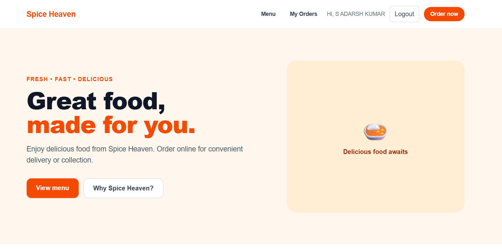
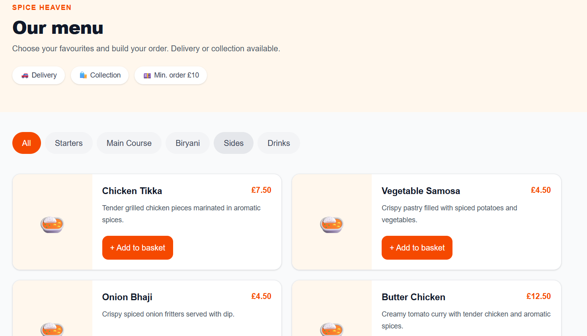
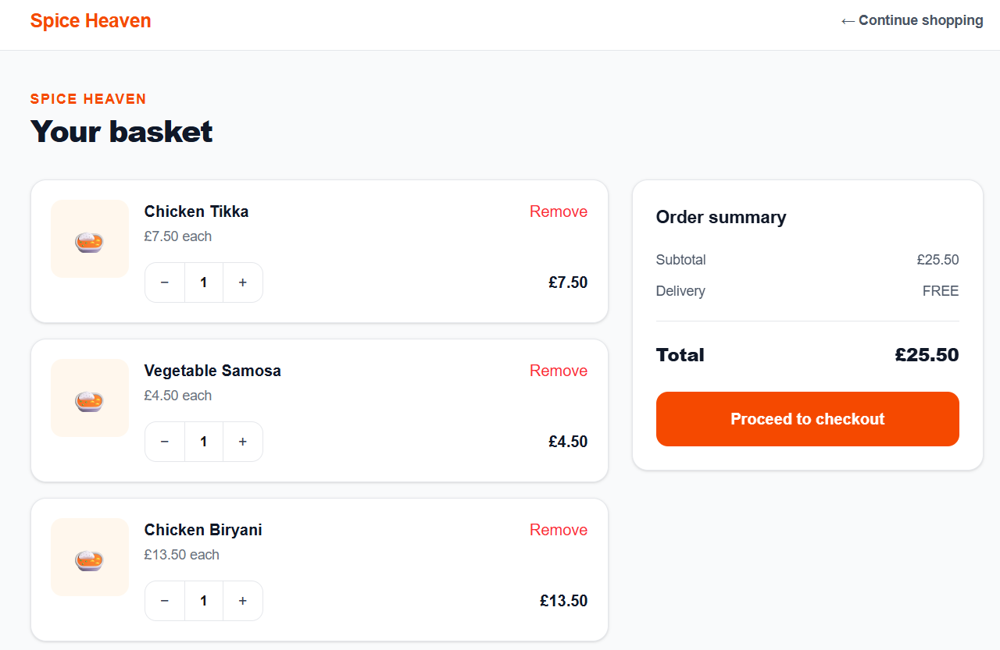
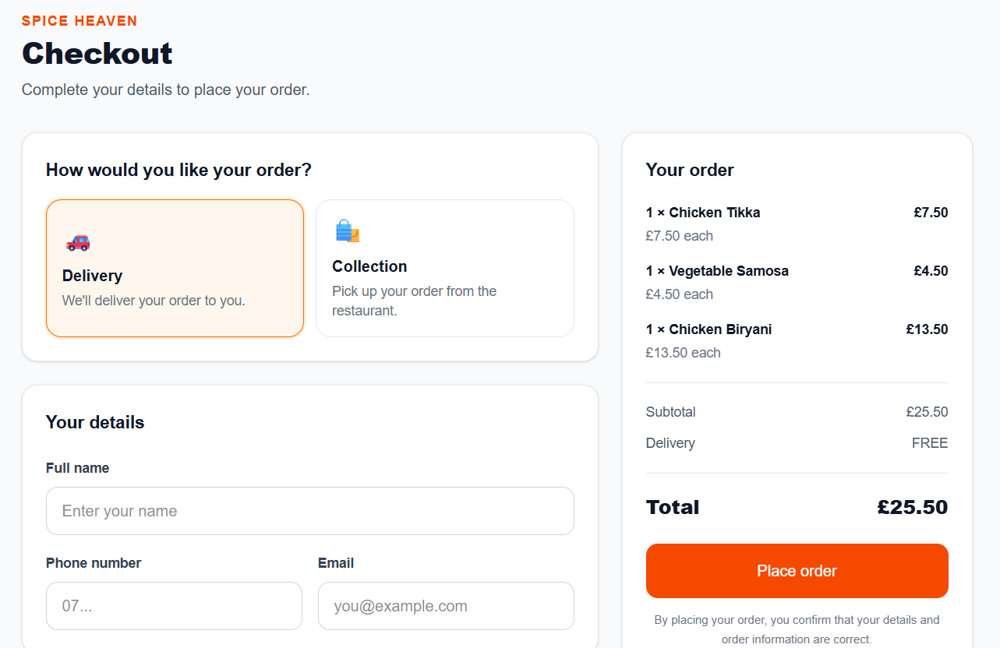
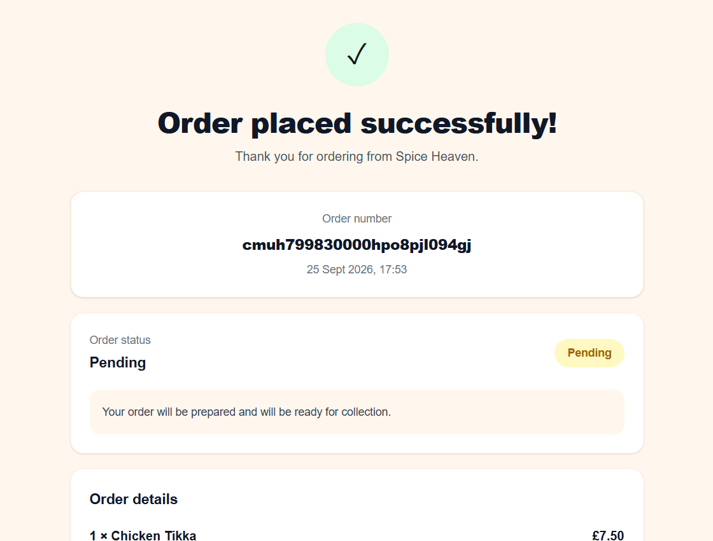
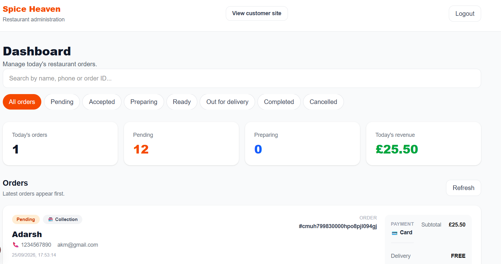

# Spice Heaven — Full-Stack Restaurant Ordering Platform

A full-stack restaurant ordering platform built for **Spice Heaven**, designed to provide a modern online ordering experience for customers and an order management system for restaurant staff.

The application supports menu browsing, basket management, delivery and collection orders, customer accounts, order history, and an authenticated restaurant admin dashboard.

> **Project status:** Core ordering and order-management functionality implemented. Production deployment, real restaurant content, online payments and further administration features are planned for later phases.

---

## Overview

Spice Heaven is being developed as a real-world restaurant ordering application rather than a static restaurant website.

Customers can browse the menu, add items to their basket, choose delivery or collection, select a payment method, place orders, and view their previous orders.

Restaurant staff have a separate authenticated dashboard for viewing and managing incoming orders through their operational workflow.

---

## Key Features

### Customer Experience

* Responsive restaurant homepage
* Menu browsing by category
* Menu item availability
* Shopping basket
* Quantity controls
* Remove items from basket
* Minimum order validation
* Delivery fee calculation
* Free delivery threshold
* Delivery or collection ordering
* Cash or card payment selection
* Customer registration and login
* Customer order history
* Order confirmation page
* Customer logout

### Restaurant Administration

* Secure admin login
* Protected admin routes
* Order dashboard
* Order search and filtering
* Order statistics
* Order status management
* Automatic order refresh
* Delivery and collection-specific workflows
* Order cancellation for eligible orders

### Order Workflow

#### Delivery

```text
PENDING
   ↓
ACCEPTED
   ↓
PREPARING
   ↓
READY
   ↓
OUT_FOR_DELIVERY
   ↓
COMPLETED
```

#### Collection

```text
PENDING
   ↓
ACCEPTED
   ↓
PREPARING
   ↓
READY
   ↓
COMPLETED
```

The backend validates order status transitions to prevent invalid workflow changes.

---

## Technology Stack

### Frontend

* Next.js
* React
* TypeScript
* Tailwind CSS
* Next.js App Router

### Backend

* Node.js
* Express
* TypeScript
* REST API
* Zod validation

### Database

* PostgreSQL
* Supabase
* Prisma ORM

### Authentication & Security

* JSON Web Tokens (JWT)
* bcrypt password hashing
* Role-based access control
* Protected customer and admin endpoints
* Helmet
* CORS
* Environment variables
* Server-side order validation

---

## Architecture

The application is split into separate frontend and backend applications.

```text
┌──────────────────────┐
│      Next.js         │
│      Frontend        │
│                      │
│ Home / Menu / Basket │
│ Checkout / Accounts  │
│ Customer Orders      │
│ Admin Dashboard      │
└──────────┬───────────┘
           │
           │ REST API
           ▼
┌──────────────────────┐
│       Express        │
│       Backend        │
│                      │
│ Authentication       │
│ Menu APIs            │
│ Order APIs           │
│ Validation           │
│ Authorization        │
└──────────┬───────────┘
           │
           │ Prisma
           ▼
┌──────────────────────┐
│ PostgreSQL / Supabase│
│                      │
│ Users                │
│ Categories           │
│ Menu Items           │
│ Add-ons              │
│ Orders               │
│ Delivery Addresses   │
│ Restaurant Settings  │
└──────────────────────┘
```

---

## Database Design

The PostgreSQL database currently includes the following main entities:

* `User`
* `Category`
* `MenuItem`
* `Addon`
* `MenuItemAddon`
* `Order`
* `OrderItem`
* `OrderItemAddon`
* `DeliveryAddress`
* `RestaurantSettings`

The database is managed using Prisma migrations and Prisma Client.

---

## Restaurant Configuration

The current development configuration includes:

| Setting         | Value                |
| --------------- | -------------------- |
| Restaurant      | Spice Heaven          |
| Cuisine         | Indian / Street Food |
| Location        | London               |
| Minimum order   | £10                  |
| Delivery fee    | £2.50                |
| Free delivery   | £25+                 |
| Delivery radius | 5 miles              |
| Opening hours   | 12:00–23:00          |

These are currently demo values and can be replaced with the restaurant's actual information.

Restaurant settings are stored in the database so that the application does not need to rely entirely on hard-coded business rules.

---

## Example Menu

The development seed data currently contains example items across:

* Starters
* Main Course
* Biryani
* Sides
* Drinks

Example items include:

* Chicken Tikka
* Vegetable Samosa
* Butter Chicken
* Chicken Tikka Masala
* Lamb Rogan Josh
* Chicken Biryani
* Garlic Naan
* Mango Lassi

The demo data can be replaced with the restaurant's actual menu, pricing, descriptions and images.

---

## Authentication

The application implements separate customer and administrator roles.

### Customer

Customers can:

* Register
* Log in
* Place orders
* View their own order history

### Administrator

Administrators can:

* Log in through the admin portal
* View restaurant orders
* Manage order statuses
* Access protected administration endpoints

Passwords are hashed using bcrypt and authentication is handled using JWTs.

The backend performs role checks independently of the frontend to prevent customers from accessing administrator-only APIs.

---

## Order Validation

Order validation is performed server-side using Zod and Prisma/database information.

The backend verifies:

* Customer details
* Order type
* Payment method
* Menu item availability
* Quantity limits
* Duplicate menu items
* Minimum order amount
* Delivery address requirements
* Order totals
* Delivery fees
* Order status transitions

Menu prices are retrieved from the database when an order is created rather than trusting prices supplied by the browser.

---

## API Structure

Example API endpoints include:

```text
GET    /api/health

POST   /api/auth/register
POST   /api/auth/login

GET    /api/categories
GET    /api/menu
GET    /api/settings

POST   /api/orders
GET    /api/orders/:id
GET    /api/orders/my-orders
GET    /api/orders
PATCH  /api/orders/:id/status
```

Protected endpoints require the appropriate customer or administrator authentication.

---

## Project Structure

```text
spice-heaven/
│
├── frontend/
│   ├── app/
│   │   ├── admin/
│   │   ├── login/
│   │   ├── register/
│   │   ├── menu/
│   │   ├── basket/
│   │   ├── checkout/
│   │   ├── orders/
│   │   └── order-confirmation/
│   │
│   ├── components/
│   ├── context/
│   ├── lib/
│   └── types/
│
├── backend/
│   ├── prisma/
│   │   ├── migrations/
│   │   ├── schema.prisma
│   │   ├── seed.ts
│   │   └── create-admin.ts
│   │
│   └── src/
│       ├── auth/
│       ├── config/
│       ├── controllers/
│       ├── middleware/
│       ├── routes/
│       ├── services/
│       └── validators/
│
└── README.md
```

---

## Local Development

### Prerequisites

* Node.js
* npm
* PostgreSQL/Supabase database

### Clone the repository

```bash
git clone <your-repository-url>
cd spice-heaven
```

### Backend setup

```bash
cd backend
npm install
```

Create:

```text
backend/.env
```

Example:

```env
DATABASE_URL="your-postgresql-connection-string"
PORT=5000
NODE_ENV=development
FRONTEND_URL="http://localhost:3000"
JWT_SECRET="your-long-random-secret"

ADMIN_NAME="Spice Heaven Admin"
ADMIN_EMAIL="admin@spicehaven.co.uk"
ADMIN_PASSWORD="your-strong-admin-password"
```

Generate Prisma Client:

```bash
npx prisma generate
```

Run migrations:

```bash
npx prisma migrate dev
```

Seed the database:

```bash
npx prisma db seed
```

Create the administrator account:

```bash
npm run create-admin
```

Start the backend:

```bash
npm run dev
```

The API will run on:

```text
http://localhost:5000
```

---

## Frontend Setup

Open another terminal:

```bash
cd frontend
npm install
```

Create:

```text
frontend/.env.local
```

Add:

```env
NEXT_PUBLIC_API_URL=http://localhost:5000/api
```

Start the frontend:

```bash
npm run dev
```

Open:

```text
http://localhost:3000
```

---

## Current Development Status

### Implemented

* Customer-facing restaurant website
* Responsive menu
* Category filtering
* Shopping basket
* Delivery and collection ordering
* Checkout
* Customer registration/login
* Customer order history
* Order confirmation
* Admin authentication
* Admin order dashboard
* Order status workflow
* PostgreSQL database
* Prisma ORM
* REST API
* Server-side validation
* Role-based authorization

### Planned

* Real restaurant branding and photography
* Full menu management from the admin dashboard
* Restaurant settings management
* Improved order notifications
* Production deployment
* Production authentication hardening
* Online payment integration
* Additional operational features

---

## Screenshots

Screenshots of the application will be added here as the UI develops.

### Homepage



### Menu



### Basket



### Checkout



### Customer Orders



### Admin Dashboard



---

## Future Improvements

The application is being developed incrementally with a focus on real-world restaurant requirements.

Future development will include production deployment, real restaurant content, enhanced administration tools, payment integration, improved notifications, and further security hardening.

---

## Author

**Adarsh Kumar**

Full-Stack Software Engineer
MSc Computer Science

Built with Next.js, React, TypeScript, Node.js, Express, PostgreSQL, Supabase and Prisma.
